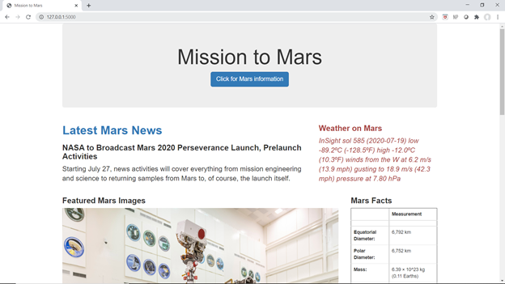
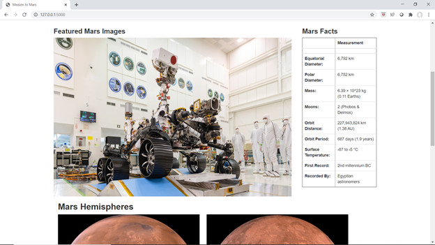
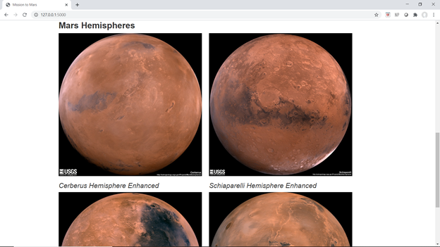

# Mission to Mars
This website displays data and images captured from leading web resources for information regarding Mars.  Each article or image was captured using webscraping techniques with Jupyter Notebooks, Python, Requests and Browser.  The website was generated using a Flask app and referencing a python scraping function.  

